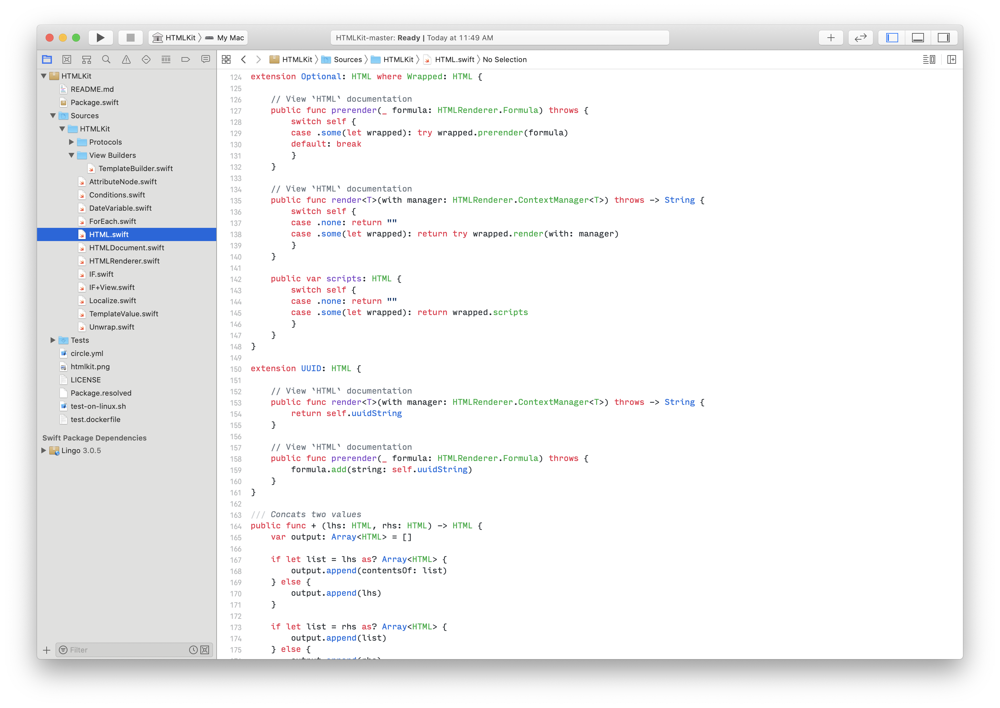
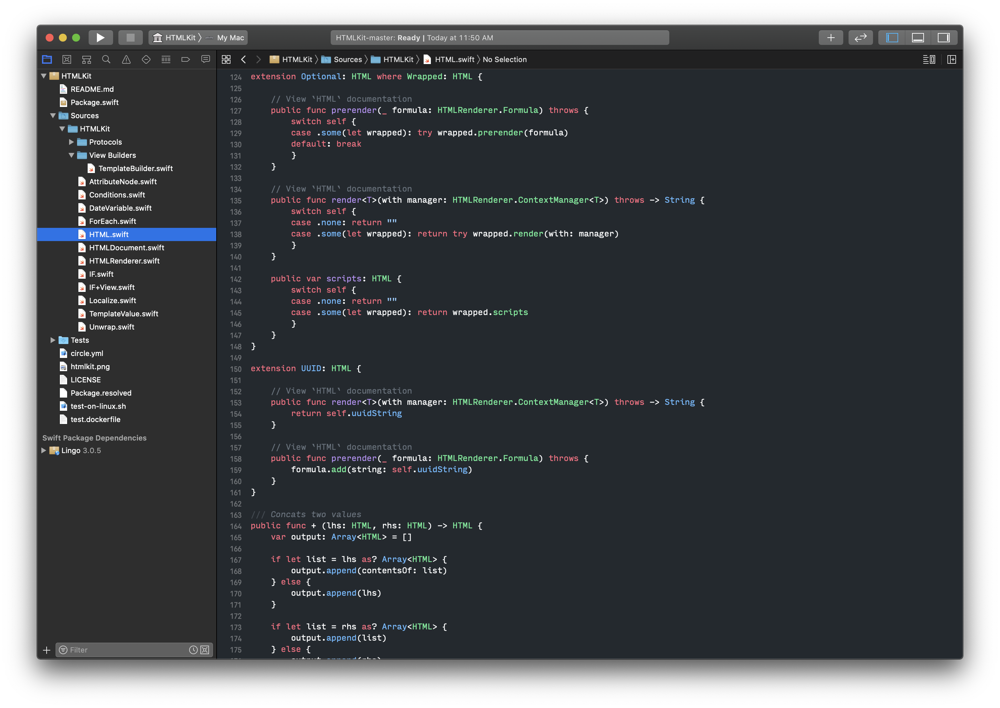

# GitHub Xcode Theme

GitHub (Light) and GitHub (Dark) are Xcode themes based on [themes of the same name](https://github.com/primer/github-vscode-theme) from GitHub for Visual Studio Code.

To install, create a directory at `~/Library/Developer/Xcode/UserData/FontAndColorThemes/` if it does not already exist and copy `GitHub (Light).xccolortheme` and `GitHub (Dark).xccolortheme` into that directory.

Or use these Bash commands:

```bash
mkdir ~/Library/Developer/Xcode/UserData/FontAndColorThemes/
cp "GitHub (Light).xccolortheme" ~/Library/Developer/Xcode/UserData/FontAndColorThemes/
cp "GitHub (Dark).xccolortheme" ~/Library/Developer/Xcode/UserData/FontAndColorThemes/
```

## GitHub (Light)



## GitHub (Dark)


